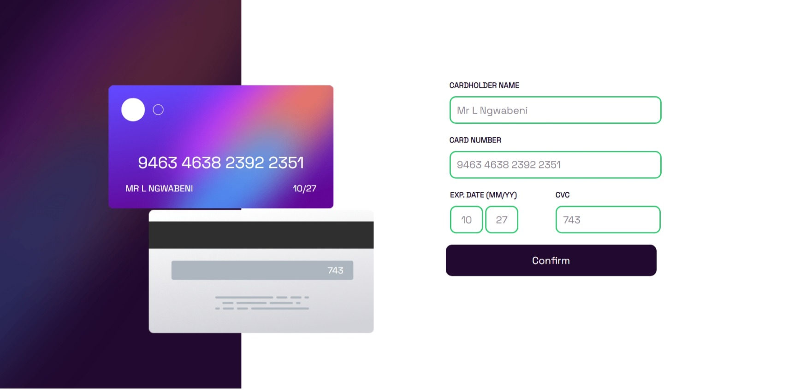

# Frontend Mentor - Interactive card details form solution

This is a solution to the [Interactive card details form challenge on Frontend Mentor](https://www.frontendmentor.io/challenges/interactive-card-details-form-XpS8cKZDWw). Frontend Mentor challenges help you improve your coding skills by building realistic projects. 

## Table of contents

- [Overview](#overview)
  - [The challenge](#the-challenge)
  - [Links](#links)
- [My process](#my-process)
  - [Built with](#built-with)
  - [What I learned](#what-i-learned)
- [Author](#author)
- [Acknowledgments](#acknowledgments)

## Overview

### The challenge

Users should be able to:

- Fill in the form and see the card details update in real-time
- Receive error messages whene exiting the text edit:
  - The card number, expiry date, or CVC fields are in the wrong format
  - Incorrect number of characters
- View the optimal layout depending on their device's screen size
- See hover, active, and focus states for interactive elements on the page

### Screenshot





### Links

- Solution URL: https://github.com/BaseHype/Interactive-card-details-form
- Live Site URL: https://deploy-preview-3--courageous-stroopwafel-c66f3f.netlify.app/

## My process

### Built with

- HTML5
- CSS custom properties
- Flexbox
- CSS Grid
- JavaScript

### What I learned

Learned a lot about JavaScript and how to use it will my HTML and CSS.

```html
<script src="js/script.js" defer></script>
```
```js
cvcCodeInput.onkeyup = function() {
    cvcCode.textContent = cvcCodeInput.value;
}
```

### Continued development

Might make adjustments to the responsiveness to accommodate other screen sizes.

## Author

- Frontend Mentor - [@BaseHype](https://www.frontendmentor.io/profile/BaseHype)

## Acknowledgments


